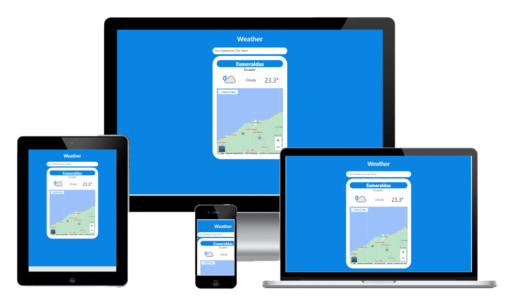

<div align="center">
    
</div>
<h1 align="center">
    Kruger Weather-Widget App
</h1>


<p align="center">
    In this repository you can find the Weather-Widget App
</p>


<div align="center">
    
</div>

## Deployment

For a live demo please click on the following link:

https://kruger-weather-widget-app.netlify.app

## About the app

This application is part of the learning process to understand and practice react using its benefits.

## Built With

- React JS 
- HTML
- CSS
- Git
- JavaScript
- Netlify
- Love ❤️‍🔥

## Getting Started

**In this repository I will practice React with the weather-widget app.**

## Run it

```bash
# Clone Repository
$ git clone https://github.com/jonato96/kruger-weather-widget-app
# Go to server folder
$ cd kruger-weather-widget-app
# Install Dependencies
$ npm i
# Run Aplication
$ npm start
```

## Acknowledgements
- VIDA MRR (YouTube Channel), please support him 🧑‍💻

- https://www.youtube.com/watch?v=oT-feDPuJmk&t=2829s 


## Authors

- 🤖 **Jonathan Sanchez Lucas**

- 🧑‍💻 GitHub: [@jonato96](https://github.com/jonato96)
- 🐤 Twitter: [@jonato96](https://twitter.com/jonato96)

## Contributing

- [Juan Sotomayor](https://github.com/Juanse7793) - Tutor FrontEnd Kruger 🤝